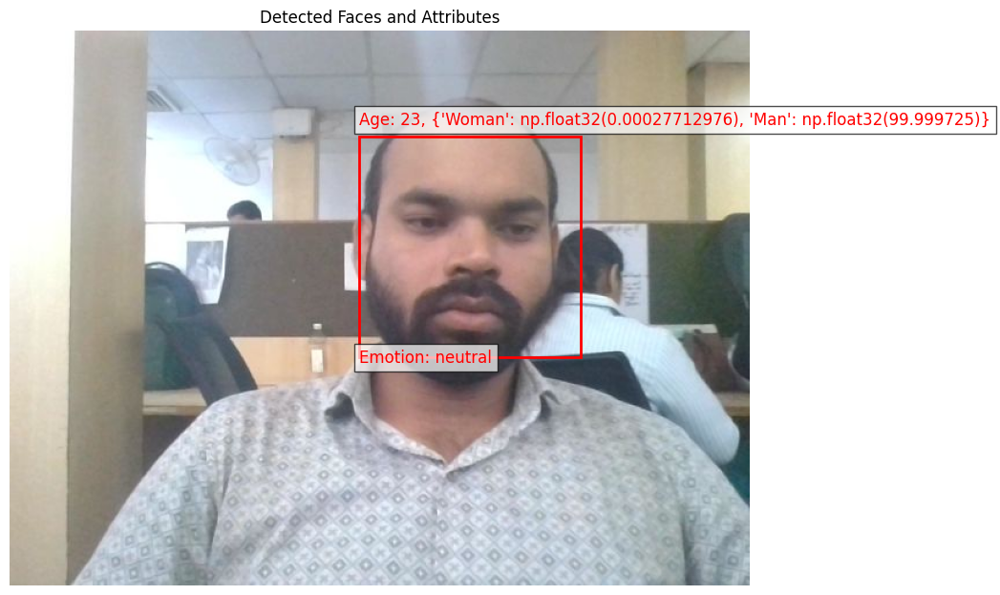
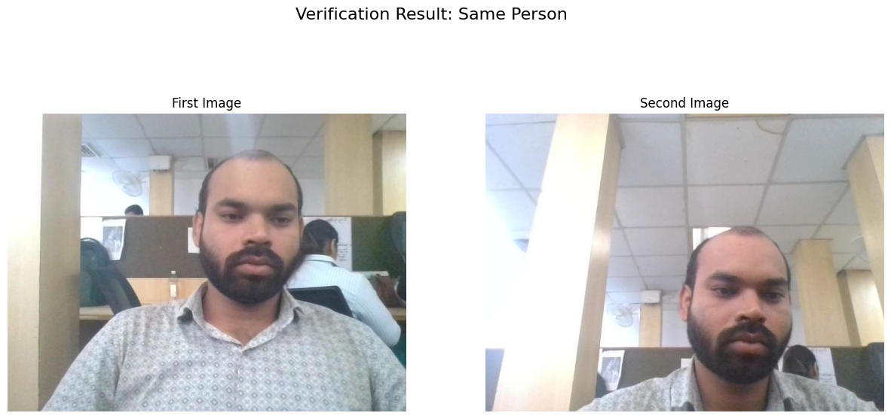

# Face Attendance API

Face recognition attendance over HTTP and WebSocket, with anti-spoofing (liveness)
that stops someone holding a photo up to the camera.

Converted from a Jupyter notebook into a deployable service: the camera lives in the
browser, embeddings are stored as packed `float32` BLOBs, attendance integrity is backed
by the database rather than by in-process state, and every liveness check is one of a
small number of business rules that a test can point at.

- [`ARCHITECTURE.md`](ARCHITECTURE.md) — layering, data model, anti-spoofing design, scale path
- [`docs/flowcharts.txt`](docs/flowcharts.txt) — 8 ASCII diagrams, from system context to deployment topology
- [`.env.example`](.env.example) — every setting, documented inline
- `/docs` while the app is running — generated OpenAPI UI
- [Output](#output--same-person) — what a run looks like, step by step

---

## Output — "Same person?"

[`streamlit_app.py`](streamlit_app.py) runs the notebook's four cells in order, in the
browser: describe the first face, take a second photo, then compare the two with DeepFace.

```bash
uv run streamlit run streamlit_app.py
# or, without uv:
.venv\Scripts\python.exe -m streamlit run streamlit_app.py
```

Each step shows a summary card and, underneath it, the same text the notebook printed.

### Example output

#### Step 1 — take a photo and describe the face

Photo from **Camera 1** → *1 face(s) detected — largest one: Man, about 22, neutral.*



| Age | Gender | Emotion |
|---|---|---|
| 22 | Man | neutral |

| Scores | |
|---|---|
| Race | black 82.58% · latino hispanic 8.38% · indian 5.54% · asian 1.92% · white 0.92% · middle eastern 0.66% |
| Emotion | neutral 99.73% · angry 0.15% · sad 0.09% · fear 0.02% · disgust 0.0% · happy 0.0% · surprise 0.0% |
| Gender | Man 100.0% · Woman 0.0% |

Notebook output:

```text
Analysis Results:
-----------------
Face Detected at: {'x': 320, 'y': 184, 'w': 155, 'h': 155, 'left_eye': None, 'right_eye': None}
Face confidence: 0.96
Age: 22
Gender: Man ({'Woman': 0.0, 'Man': 100.0})
Race: black ({'asian': 1.92, 'indian': 5.54, 'black': 82.58, 'white': 0.92, 'middle eastern': 0.66, 'latino hispanic': 8.38})
Emotion: neutral ({'angry': 0.15, 'disgust': 0.0, 'fear': 0.02, 'happy': 0.0, 'sad': 0.09, 'surprise': 0.0, 'neutral': 99.73})
```

#### Step 2 — take a second photo and verify

Photo from **Camera 2** → ✅ **Verification Result: Same Person**



| Distance | Threshold | Time |
|---|---|---|
| 0.070 | 0.40 | 10.96 s |

Facenet · opencv · cosine — a distance **below** the threshold means the same person.

Notebook output:

```text
Verification Result:
result.get('verified')=True, round(float(result.get('distance', 0)), 4)=0.0701 (cosine distance, below the threshold means the same person), round(float(result.get('threshold', 0)), 2)=0.4, result.get('model')='Facenet', result.get('detector_backend')='opencv', result.get('similarity_metric')='cosine', round(float(result.get('time', 0)), 2)=10.96s
facial_areas: {'img1': {'x': 320, 'y': 184, 'w': 155, 'h': 155, 'left_eye': None, 'right_eye': None}, 'img2': {'x': 295, 'y': 149, 'w': 153, 'h': 153, 'left_eye': None, 'right_eye': None}}

The two images belong to the same person.
```

### Reading the result

| Field | Meaning |
|---|---|
| `verified` | `True` when `distance <= threshold` |
| `distance` | Cosine distance between the two face embeddings; `0` = identical, smaller = more alike |
| `threshold` | DeepFace's tuned cut-off for this model and metric (Facenet + cosine = `0.40`) |
| `facial_areas` | Face box in each photo; `left_eye`/`right_eye` are `None` because the `opencv` detector found no eye landmarks |
| `time` | Seconds for the whole verify call, including detection |

Here `0.0701` is far below `0.40`, so the match is clear. Values close to the threshold
(about `0.32–0.40`) are borderline; retake the photo with the face straight on and in good light.

---

## Requirements

**Python 3.11 or 3.12.** TensorFlow, which DeepFace depends on, publishes no wheels for
CPython 3.13 or 3.14, so the notebook's original dependency set cannot be installed on a
newer interpreter at all. `pyproject.toml` declares `requires-python = ">=3.11,<3.14"` and
the `Dockerfile` pins `python:3.11-slim`.

```bash
# With uv
uv sync --extra face --extra liveness

# Or plain pip
python -m venv .venv && . .venv/bin/activate     # .venv\Scripts\activate on Windows
pip install -r requirements.txt
```

`opencv-python-headless` is the only OpenCV build that works here. The GUI build needs
`libGL`, which is missing from slim images and hard-crashes on import; `cv2.imshow` has no
display in a container anyway, because the camera belongs to the kiosk. OpenCV must also
stay **below 5.0** — v5 removed `cv2.CascadeClassifier`, which is the eye detector behind
the blink challenge. Losing it does not crash the service: liveness reports itself
unavailable and `REQUIRE_LIVENESS` then refuses every punch.

### Running without the face model

`EMBEDDING_BACKEND=stub` is a deterministic no-op used by the test suite and for API
development. It is hard-blocked from writing an attendance row unless
`ALLOW_STUB_BACKEND=true`, so a development configuration cannot quietly become a real
punch.

---

## Running it

```bash
cp .env.example .env          # set API_KEYS and CORS_ORIGINS before exposing this
uvicorn app.main:app --reload
```

or, without uv, `python app.py` — a preflight runner that reconfigures the console for
UTF-8, checks the optional dependencies, then execs uvicorn.

```bash
curl localhost:8000/health/ready   # 503 until the face model is actually resident
curl localhost:8000/docs
```

### Docker

```bash
cp .env.example .env
docker compose up --build
curl localhost:8000/health/ready
```

Two build-time decisions worth knowing:

- **Facenet weights are baked into the image.** Without that, the first request pays a
  ~90 s download inside the function's own request timeout.
- **One uvicorn worker, on purpose.** Each worker holds its own ~500 MB TensorFlow model
  and its own roster cache. Scale with more containers, not more workers, until the model
  moves out of process.

`docker-compose.yml` binds to `127.0.0.1` deliberately. Put a TLS-terminating reverse proxy
in front of this; face frames and attendance should not cross a network in plain HTTP.

---

## Configuration

Every setting is read from the environment (or `.env`) and **validated at startup** by
`pydantic-settings` — a bad value fails the boot, not the first punch of the day. Two
examples that matter more than the rest:

- `ALERT_WEBHOOK_URL` must be `http` or `https`. The value goes straight to
  `urllib.request.urlopen`, so anything else is rejected at boot rather than becoming a
  surprise at 2am.
- `BUSINESS_TIMEZONE` must be a real IANA zone. `zoneinfo` has no database on Windows
  without the `tzdata` package, which is why `tzdata` is a declared dependency rather
 than an optional one.

`ENVIRONMENT=prod` turns on API key enforcement. With `API_KEYS` empty *and*
`ENVIRONMENT=prod`, the service answers **503** rather than serving the roster
unauthenticated — a loud failure at deploy time instead of an open door.

Full table: [ARCHITECTURE.md §8](ARCHITECTURE.md#8-configuration).

---

## The workflow

### 1. Enrol someone

Registration is multi-frame on purpose. One snapshot produces a vector with a wide
intra-class spread, which widens the impostor tail; averaging five samples tightens the
same person's spread and buys back margin at the match threshold.

```bash
# Open a session (multipart/form-data)
curl -X POST localhost:8000/api/v1/users/enroll/start \
  -F id=EMP101 -F 'name=Ada Lovelace' -F samples=5

# Five live frames from the kiosk
for i in 1 2 3 4 5; do
  curl -X POST localhost:8000/api/v1/users/enroll/$ENROLLMENT_ID/sample \
    -F image=@frame$i.jpg
done

# Average, L2-normalise, upsert
curl -X POST localhost:8000/api/v1/users/enroll/$ENROLLMENT_ID/finalize
```

A single-image `POST /api/v1/users` exists and works, but it gives you a materially worse
match rate than the five-sample path.

### 2. Verify

```bash
# multipart form
curl -X POST localhost:8000/api/v1/recognition/verify/upload \
  -F image=@frame.jpg

# or JSON with base64 (a full data: URI is also accepted)
curl -X POST localhost:8000/api/v1/recognition/verify \
  -H 'Content-Type: application/json' \
  -d '{"image_base64":"'"$(base64 -w0 frame.jpg)"'"}'
```

The response carries a **distance**, not a boolean. `match.decision` is one of three:

| `match.decision` | Meaning |
|---|---|
| `match` | Within `MATCH_THRESHOLD`; eligible to punch |
| `review` | In the gray zone (`MATCH_THRESHOLD` … `MATCH_THRESHOLD × MATCH_GRAY_ZONE_FACTOR`); written to `events` for a human |
| `unknown` | No roster match; `match` is `null` |

Spoofing is a **separate** signal, not a fourth decision: it surfaces as
`liveness.flags` / `liveness.passive_verdict`, and it is the punch — not the verify —
that refuses.

The gray zone exists because the dangerous failure of a face system is not rejecting a
stranger — it is confidently writing a *wrong* identity. Borderline cases should reach a
human.

When the frame is eligible, the response also carries a **`verification_id`**: a
short-lived, single-use, server-issued proof of *which* face was seen and *how well* it
matched. Hold on to it — it is the only way to punch.

### 3. Punch

The punch body names **no person and no distance**. Both used to be client-supplied
fields, and both were things the caller got to choose: `user_id` decided who got marked
present, `match_distance` decided whether the identity had been verified at all. Now the
server is the only source of both, and the client contributes a proof instead of a claim:

```bash
# 1. recognise the person (see §2) -> {"match": {...}, "verification_id": "…"}
# 2. run the liveness challenge   -> {"status": "passed", "session_id": "…"}
# 3. spend both, together, exactly once
curl -X POST localhost:8000/api/v1/attendance/punch -H 'Content-Type: application/json' -d '{
  "verification_id": "…from /recognition/verify…",
  "liveness_session_id": "…passed session id…",
  "liveness_score": 0.88,
  "device_id": "gate-04",
  "source": "kiosk"
}'
```

`extra="forbid"` on the schema means a legacy client that still sends `user_id` or
`match_distance` gets a loud `422 validation_error` rather than a silently-ignored field
— a kiosk must not believe it marked the person it aimed at when the server marked
somebody else.

`verification_id` and `liveness_session_id` are both **single-use** and both expire
(`VERIFICATION_TTL_SECONDS`, default 120s). Two links, so neither a captured face frame
nor a completed challenge can be doubled up.

On success: `{"attendance": {…}, "created": true, "duplicate_suppressed": false,
"message": "…"}`. Refusals are typed errors with stable codes, so a kiosk branches on the
code rather than on prose:

| HTTP | `error.code` | Cause |
|---|---|---|
| 403 | `liveness_required` | No passed, unconsumed liveness session, or it was already spent |
| 403 | `identity_mismatch` | The liveness session was started for a **different** person than the verification named |
| 403 | `spoof_suspected` | The server's own passive check flagged the frame that earned the grant |
| 404 | `user_not_found` | Unknown or deactivated user |
| 422 | `validation_error` | Missing `verification_id`, or a legacy client sent the removed fields |
| 422 | `unverified_identity` | No usable grant (`error.context.reason`: `unknown_verification`, `verification_already_used`, `verification_expired`), or its distance is now worse than the threshold |

---

## Liveness

### Why not just "ask for a blink"

Because a pre-recorded montage of the real person defeats it. The defence is the
*sequence*, not any single challenge:

- challenge **order** is randomised per session
- each challenge has a randomised **reveal delay** (0.6–2.2 s) and a randomised gap
  between challenges (0.4–1.4 s), so a recording cannot be timed to the script
- each challenge must be followed by a **return to neutral** before the next one counts
- the server checks **frame-rate plausibility**, so a 4×-accelerated replay is rejected
  on timing alone
- attempts are capped **per session** (`LIVENESS_MAX_ATTEMPTS`) *and* across sessions:
  that many failures for one identity inside `LIVENESS_LOCKOUT_SECONDS` returns
  `429 liveness_locked_out`, and the lock then runs for `LIVENESS_LOCKOUT_SECONDS` from the
  *last* failure — the countdown in the body is the real one, so a target cannot simply be
  worked on with a fresh session each time. Set `LIVENESS_LOCKOUT_SECONDS=0` to disable. The
  cross-session half needs a named identity — an anonymous session has nothing to count
  failures against
- missing eye evidence **fails closed** — liveness is unavailable, so no punch is allowed

Two independent signals, because one is not enough:

- **Active** (challenge–response, above) is the primary defence.
- **Passive** (per-frame texture, colour, specular, edge and flatness statistics, fused
  into one score; optionally a small mini-FASNet ONNX via `LIVENESS_FASNET_MODEL`) runs
  on every frame and is the secondary defence.

### The integrity rule

With `REQUIRE_LIVENESS=true`, **no path writes an attendance row without all three of:**

1. an unspent `verifications` grant naming the user, carrying the distance this process
   measured (`app/services/verifications.py`);
2. a `liveness_sessions` row that is `status='passed'` and `consumed_at IS NULL` **and was
   started for that same user**;
3. a distance still inside `MATCH_THRESHOLD` at punch time.

Point 2 is the one that closes the obvious bypass. Passing a challenge proves that *a* live
human was present; without a binding it also authorises a punch for whoever the caller
names. Sessions started with a `user_id` are bound to it from the start, and an anonymous
session adopts the first person who spends it. This lives in `app/services/punch.py` so
the HTTP route and the WebSocket path enforce identical semantics — verified by
`tests/test_punch.py`.

The gate order is deliberate: the grant is resolved and its distance checked **before**
anything is consumed, so a stale id or a stopped roster entry cannot burn a liveness
session the user just spent a minute earning.

### Honest limits

**A real-time prerecorded video of the actual person defeats 2D liveness.** Every
challenge here is observable from pixels — a blink is visible, a head turn is visible,
frame timing is visible. Randomised order and reveal delays raise the cost of building a
recording; they do not make it impossible, and no 2D heuristic can.

Against printed photos, flat screen replays and stills, this is genuinely effective. For
anything stronger you need a depth or IR sensor, a challenge the recording cannot
reproduce (head nod with depth), or a server-side camera the attacker does not control.

Also worth stating plainly: passive scores near the bar are treated as *inconclusive*, not
as an accusation. A liveness model that wrongly blocks a real employee is a worse failure
than a missed spoof.

---

## WebSocket protocol

`/api/v1/stream/verify` is the browser replacement for the notebook's `cv2.imshow` loop.
The camera is on the client; the server receives JPEGs. **One frame produces one analysis,
fanned out to both the match result and the liveness state machine** — the same
`verify_frame` pipeline the HTTP route uses.

Server sends `ready` on connect:

```json
{"type":"ready","identity":"…","liveness_available":true,"liveness_reasons":[],
 "require_liveness":true,"challenges":["blink","head_turn_left","head_turn_right","move_closer"],
 "max_fps":15.0,"match_threshold":0.4}
```

| Client → server | Effect |
|---|---|
| `{"type":"start_liveness","user_id":"EMP101"}` | Randomised challenge plan; server replies `liveness`. The `user_id` **binds** the session |
| `{"type":"frame","data":"<base64 jpeg>","seq":12}` | One analysis; server replies `result` |
| `{"type":"punch"}` | Authorised by server-side liveness state and the server's own last match, not by the client |
| `{"type":"ping"}` / `{"type":"stop"}` | Replies `pong` / `bye` |

Server → client: `ready`, `liveness`, `result`, `punch`, `pong`, `bye`, `error`.

`punch` takes **no evidence in the message**. The socket mints its own single-use
`verification_id` from the match it already computed for the most recent frame and spends
it through the same shared `punch_attendance` the HTTP route uses, so the two transports
cannot drift apart. A `user_id` or `match_distance` in the message is ignored; a
`user_id` that *disagrees* with the server's match is refused with
`{"ok":false,"code":"identity_mismatch"}` rather than resolved in the caller's favour.
One accepted punch clears the socket's match evidence and its liveness state, so
re-punching needs a fresh frame.

Frames arriving faster than `max_fps` are **counted and dropped with no reply**, because
queueing a video backlog only makes the round trip worse. A send loop must therefore
tolerate a `seq` that goes backwards.

### Minimal browser client

```html
<video id="cam" autoplay playsinline muted></video>
<script>
const ws = new WebSocket(`ws://${location.host}/api/v1/stream/verify`);
let best = null;

ws.onmessage = (e) => {
  const m = JSON.parse(e.data);
  if (m.type === "ready") {
    // Bind the challenge to one person. Omit user_id for an open kiosk, and
    // the first person to pass the challenge adopts the session.
    ws.send(JSON.stringify({ type: "start_liveness", user_id: "EMP101" }));
  } else if (m.type === "liveness") {
    // Render m.prompt and m.active_challenge; m.challenges carries the whole
    // plan (name, instruction, revealed, progress) including not-yet-revealed
    // entries, which the client must not display early -- the randomised
    // reveal schedule is the anti-replay property.
    renderChallenge(m.prompt, m.active_challenge, m.status);
  } else if (m.type === "result") {
    if (m.match && m.match.decision === "match") best = m;
  } else if (m.type === "punch") {
    report(m.ok, m.message || m.code);
  } else if (m.type === "error") {
    console.warn("server:", m.code, m.message);
  }
};

const canvas = document.createElement("canvas");
const ctx = canvas.getContext("2d");

setInterval(async () => {
  if (ws.readyState !== 1) return;
  const v = document.getElementById("cam");
  if (!v.videoWidth) return;
  canvas.width = 480; canvas.height = 360;             // downscale before sending
  ctx.drawImage(v, 0, 0, canvas.width, canvas.height);
  ws.send(JSON.stringify({
    type: "frame",
    data: canvas.toDataURL("image/jpeg", 0.6).split(",")[1],
    seq: performance.now(),
  }));
}, 120);                                              // ~8 fps, under the 15 fps ceiling

function punch() {
  // No user_id, no match_distance, no liveness_session_id: the server
  // authorises this from its own liveness state and its own last match.
  // `best` is only used to check there is somebody to punch.
  if (best) ws.send(JSON.stringify({ type: "punch" }));
}
</script>
```

Run it over HTTPS (or `localhost`) — browsers will not grant camera access to a page
served over plain HTTP.

---

## Calibrating `MATCH_THRESHOLD`

The default `0.40` is a starting point for Facenet, not a universal truth. It has to be
measured against *your* roster, cameras and lighting.

```bash
# 1. Enrol everyone. Gather several genuine frames per person.
# 2. Collect the distances that genuine frames produce.
#    POST /api/v1/recognition/verify returns the distance for every frame;
#    feed each result through GET /api/v1/attendance/export.csv, or read
#    the `match_distance` column on the attendance rows.
# 3. Set MATCH_THRESHOLD above the genuine 95th percentile.
# 4. Confirm impostor distances sit clear of the gray zone. For a quick
#    check, run every person's frames against a *different* person's
#    enrolment: distances that land below your threshold are your real
#    false-accept rate.
# 5. Raise MATCH_GRAY_ZONE_FACTOR if too many genuine frames land in review.
```

Aim for a gray zone that catches the genuine tail without swallowing the impostor
distribution. A rising `review` rate over time is the signal that a camera moved, the
lighting changed, or the roster went stale — it shows up days before anyone complains
that the system "isn't working".

Record the chosen values in `ARCHITECTURE.md §8` when you settle them, so the next person
to recalibrate knows what the number was derived from.

---

## Tests

```bash
pytest                        # 229 tests
ruff check .                  # lint
```

The suite is written to prove the security properties rather than to cover lines:

| File | Proves |
|---|---|
| `tests/test_punch.py` | A punch cannot be written without an unspent verification grant **and** a passed, unconsumed liveness session **for the same person**; neither token can be doubled; the gate order cannot burn a good token on a bad request; nothing the caller sends decides *who* is punched |
| `tests/test_api.py` | The HTTP contract, including that the removed `user_id` / `match_distance` fields now fail loudly and that every data route is behind the API key in prod |
| `tests/test_active_liveness_e2e.py` | The full chain over **both** HTTP and WebSocket, driven by a scripted virtual user with an injected fake clock |
| `tests/test_quality.py` | The frame and face gates reject blur, bad exposure, flat regions, undersized crops |
| `tests/test_config.py` | Every startup validator rejects bad input rather than booting with it |
| `tests/test_db.py` | A relative SQLite path resolves against the project root, so the same command from a different directory opens the same database |
| `tests/test_embeddings.py` | BLOB round-trip, dimension and NaN guards |
| `tests/test_passive_liveness.py` | Feature extraction and band-pass mappings |

The e2e liveness tests inject `FrameSignals` at the `extract_signals` seam rather than
driving the real Haar cascade: a synthetic ellipse is not a face, so exercising the real
detector would be a test of OpenCV rather than of this application. They skip
automatically when OpenCV is unavailable.

---

## Layout

```
app/
  config.py            Settings, validated at startup
  models.py            ORM + UtcDateTime (naive datetimes are how punch times go wrong)
  schemas.py           pydantic request/response contracts
  deps.py              auth, rate limiting
  errors.py            typed errors → status codes
  api/                 routers: users, recognition, liveness, attendance, alerts, stream, health
  services/
    face.py            FaceAnalyzer protocol; deepface and stub implementations
    quality.py         frame/face gate, pure numpy
    embeddings.py      float32 pack/unpack, L2 normalise, average
    registry.py        cached roster matrix + invalidation
    pipeline.py        verify_frame() — one frame, one decision
    verifications.py   single-use identity grants — the punch's only proof of *who*
    punch.py           every attendance security rule, shared by HTTP and WS
    events.py          audit rows + webhook dispatch
    liveness/          active FSM, passive scoring, geometry
tests/                 218 tests
scripts/               feature inspection helpers
```

---

## Privacy

Embedding vectors are biometric data. Treat a database dump as PII, with the access
controls that implies. No endpoint returns embedding bytes, frames are processed in
memory and discarded, and images are never written to disk. Spoof flags are stored on the
attendance row so historical punches can be re-scored later without retaining images.